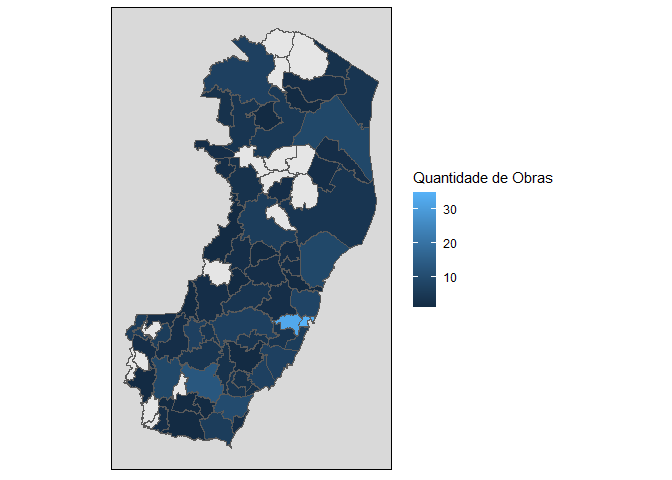

<!-- README.md is generated from README.Rmd. Please edit that file -->

Esta análise é resultado do Levantamento objeto do Processo TC
707/2020-2 do Tribunal de Contas do Estado do Espírito Santo.

Os documentos do processo podem ser consultados no seguinte endereço:

<https://www.tcees.tc.br/consultas/processo/>

------------------------------------------------------------------------

## Introdução

O levantamento realizado teve por objetivo consolidar as informações
referentes ao quantitativo de obras paralisadas, por jurisdicionado e
por tipo de obra, os valores por fonte de recurso e os principais
motivos das paralisações.

Foram recebidos dados de obras paralisadas desde 2012 até 2020, quando
foi realizado o levantamento.

## Resultados

Segundo o Levantamento, existem **290** obras paralisadas no ES,
divididas por Microrregião Administrativa conforme a tabela abaixo:

<table class="table" style="margin-left: auto; margin-right: auto;">
<thead>
<tr>
<th style="text-align:left;">
Microrregião
</th>
<th style="text-align:right;">
Obras Paralisadas
</th>
</tr>
</thead>
<tbody>
<tr>
<td style="text-align:left;">
Metropolitana
</td>
<td style="text-align:right;">
94
</td>
</tr>
<tr>
<td style="text-align:left;">
Litoral Sul
</td>
<td style="text-align:right;">
36
</td>
</tr>
<tr>
<td style="text-align:left;">
Central Sul
</td>
<td style="text-align:right;">
25
</td>
</tr>
<tr>
<td style="text-align:left;">
Sudoeste Serrana
</td>
<td style="text-align:right;">
25
</td>
</tr>
<tr>
<td style="text-align:left;">
Caparaó
</td>
<td style="text-align:right;">
22
</td>
</tr>
<tr>
<td style="text-align:left;">
Noroeste
</td>
<td style="text-align:right;">
22
</td>
</tr>
<tr>
<td style="text-align:left;">
Nordeste
</td>
<td style="text-align:right;">
21
</td>
</tr>
<tr>
<td style="text-align:left;">
Rio Doce
</td>
<td style="text-align:right;">
19
</td>
</tr>
<tr>
<td style="text-align:left;">
Centro-Oeste
</td>
<td style="text-align:right;">
15
</td>
</tr>
<tr>
<td style="text-align:left;">
Central Serrana
</td>
<td style="text-align:right;">
11
</td>
</tr>
</tbody>
</table>

E a mesma quantidade, desta vez por Unidade Gestora (mostrando as 10
primeiras ocorrências):

<table>
<thead>
<tr>
<th style="text-align:left;">
Unidade Gestora
</th>
<th style="text-align:center;">
Obras Paralisadas
</th>
<th style="text-align:right;">
Valor total (milhões)
</th>
</tr>
</thead>
<tbody>
<tr>
<td style="text-align:left;">
DEPARTAMENTO DE ESTRADAS E RODAGEM DO ESPÍRITO SANTO
</td>
<td style="text-align:center;">
22
</td>
<td style="text-align:right;">
R$ 326,78
</td>
</tr>
<tr>
<td style="text-align:left;">
PREFEITURA MUNICIPAL DE CARIACICA
</td>
<td style="text-align:center;">
19
</td>
<td style="text-align:right;">
R$ 56,35
</td>
</tr>
<tr>
<td style="text-align:left;">
PREFEITURA MUNICIPAL DE VITÓRIA
</td>
<td style="text-align:center;">
14
</td>
<td style="text-align:right;">
R$ 93,06
</td>
</tr>
<tr>
<td style="text-align:left;">
SECRETARIA DE ESTADO DA AGRICULTURA, ABASTECIMENTO, AQUICULTURA E PESCA
</td>
<td style="text-align:center;">
14
</td>
<td style="text-align:right;">
R$ 57,79
</td>
</tr>
<tr>
<td style="text-align:left;">
INSTITUTO DE OBRAS PÚBLICAS DO ESPÍRITO SANTO
</td>
<td style="text-align:center;">
11
</td>
<td style="text-align:right;">
R$ 326,37
</td>
</tr>
<tr>
<td style="text-align:left;">
PREFEITURA MUNICIPAL DE CACHOEIRO DE ITAPEMIRIM
</td>
<td style="text-align:center;">
11
</td>
<td style="text-align:right;">
R$ 12,50
</td>
</tr>
<tr>
<td style="text-align:left;">
PREFEITURA MUNICIPAL DE ITAPEMIRIM
</td>
<td style="text-align:center;">
10
</td>
<td style="text-align:right;">
R$ 37,12
</td>
</tr>
<tr>
<td style="text-align:left;">
PREFEITURA MUNICIPAL DE ALEGRE
</td>
<td style="text-align:center;">
9
</td>
<td style="text-align:right;">
R$ 1,80
</td>
</tr>
<tr>
<td style="text-align:left;">
COMPANHIA ESPÍRITO SANTENSE DE SANEAMENTO
</td>
<td style="text-align:center;">
7
</td>
<td style="text-align:right;">
R$ 68,04
</td>
</tr>
<tr>
<td style="text-align:left;">
PREFEITURA MUNICIPAL DE ANCHIETA
</td>
<td style="text-align:center;">
7
</td>
<td style="text-align:right;">
R$ 7,84
</td>
</tr>
</tbody>
</table>

## Visualização dos dados

Essas obras dividem-se no território capixaba segundo o seguinte mapa:

Obras paralisadas por município

É possível verificar no mapa acima os municípios em tons de azul mais
claros - aqueles que possuem maior quantidade de obras paralisadas:
Vitória e Cariacica.

O caso de Vitória deve ser analisado com cuidado, uma vez que várias
obras do Governo do Estado estão localizadas no município, sem que isso
signifique que são obras paralisadas de responsabilidade da Prefeitura
Municipal de Vitória.

## Motivos

O levantamento questionou também os motivos para a paralisação das
obras. Os principais motivos apontados pelos respondentes foram os
seguintes:

<table>
<thead>
<tr>
<th style="text-align:left;">
Motivo
</th>
<th style="text-align:right;">
Obras Paralisadas
</th>
</tr>
</thead>
<tbody>
<tr>
<td style="text-align:left;">
ABANDONO DA OBRA PELA CONTRATADA
</td>
<td style="text-align:right;">
39
</td>
</tr>
<tr>
<td style="text-align:left;">
QUESTÕES TÉCNICAS QUE VIERAM A SER CONHECIDAS SOMENTE APÓS A LICITAÇÃO
</td>
<td style="text-align:right;">
36
</td>
</tr>
<tr>
<td style="text-align:left;">
CONTINGENCIAMENTO DE RECURSOS PRÓPRIOS
</td>
<td style="text-align:right;">
31
</td>
</tr>
<tr>
<td style="text-align:left;">
DIFICULDADE DE EXECUÇÃO CONFORME PREVISTO EM PROJETO
</td>
<td style="text-align:right;">
25
</td>
</tr>
<tr>
<td style="text-align:left;">
INCAPACIDADE FINANCEIRA DA CONTRATADA
</td>
<td style="text-align:right;">
20
</td>
</tr>
<tr>
<td style="text-align:left;">
AGUARDANDO TRÂMITE INTERNO DE ADITIVO
</td>
<td style="text-align:right;">
18
</td>
</tr>
<tr>
<td style="text-align:left;">
ATRASO NO REPASSE DE RECURSOS
</td>
<td style="text-align:right;">
18
</td>
</tr>
<tr>
<td style="text-align:left;">
PROJETO BÁSICO DEFICIENTE
</td>
<td style="text-align:right;">
18
</td>
</tr>
<tr>
<td style="text-align:left;">
INCAPACIDADE TÉCNICA DA CONTRATADA
</td>
<td style="text-align:right;">
15
</td>
</tr>
<tr>
<td style="text-align:left;">
ALTERAÇÕES CONTRATUAIS COM REFLEXOS NO LIMITE DO PERCENTUAL DE ADITIVOS
</td>
<td style="text-align:right;">
10
</td>
</tr>
</tbody>
</table>

No gráfico a seguir é possível verificar as expressões mais frequentes
nos motivos apontados.

Mapa de Palavras - Motivos

Ou seja, grande parte das paralisações de obras devem-se a problemas com
as **Contratadas**. Por outro lado, é responsabilidade da Contratante a
correta escolha das Contratadas, bem como a punição em caso de
inadimplemento contratual.

## Conclusões

As obras paralisadas representam o maior insucesso de uma obra pública.

Ainda que sobrepreço, superfaturamento ou direcionamento de licitações
sejam irregularidades gravíssimas e passívels de punição, a obra
inacabada - que por muitas vezes carrega parte das irregularidades
citadas - traz um prejuízo maior à população, que não vê o recurso de
seus impostos concretizado em uma escola, um posto de saúde, uma rua ou
qualquer outra construção que possa ser utilizada.

Desta forma, o Tribunal de Contas realizou esse levantamento para, em um
primeiro momento, conhecer a realidade das obras paralisadas e, em um
passo seguinte, orientar os órgãos públicos sobre como reduzir esse
desperdício dos recursos públicos.
